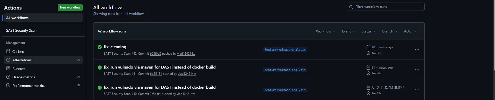
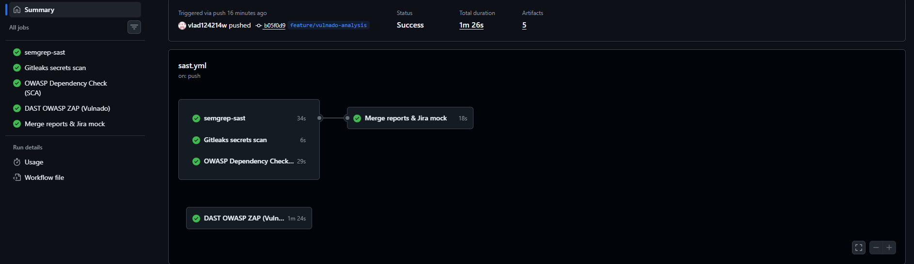
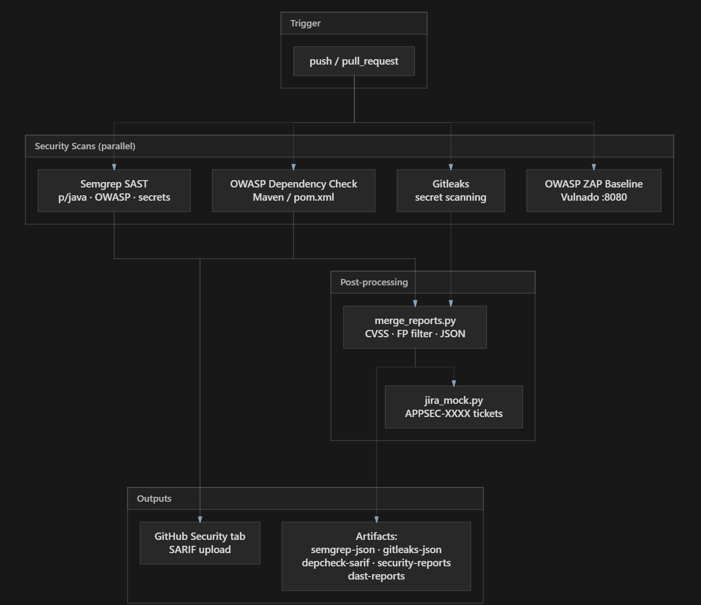
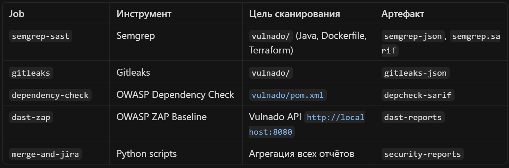
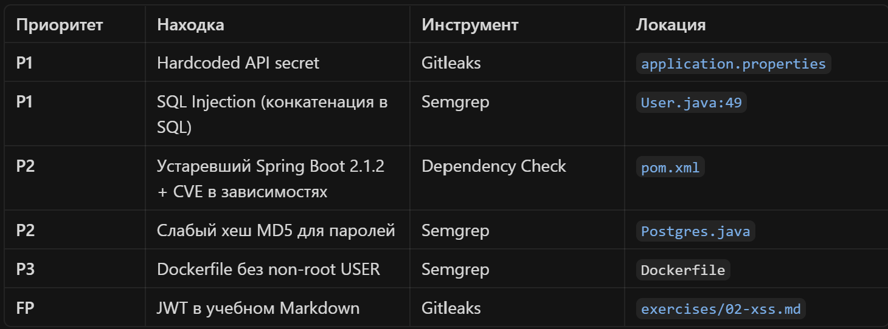
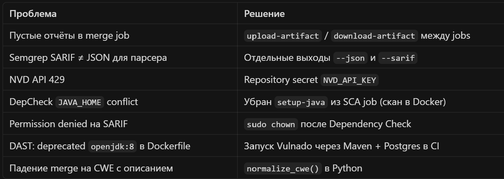
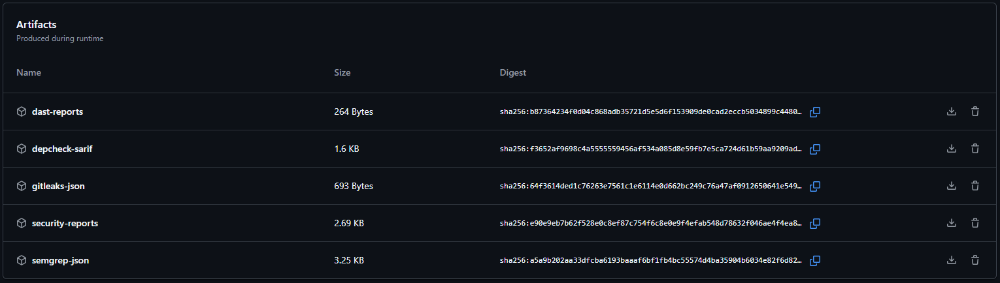

# appsec-learning-portfolio

**Связаться: Telegram @Magic_099**

Application Security Portfolio | DevSecOps Pipeline

Учебное портфолио Application Security / DevSecOps: end-to-end CI/CD с SAST, SCA, поиском секретов и DAST.
Кейс — экспресс-анализ намеренно уязвимого Java-приложения Vulnado с triage, приоритизацией по CVSS и mock-интеграцией в Jira.

Что это за проект:

Репозиторий демонстрирует навыки AppSec-инженера:

автоматический security-сканинг на каждый push/PR;
объединение отчётов разных инструментов в единый формат;
фильтрация false positives и приоритизация по severity/CVSS;
подготовка находок к remediation (mock-тикеты Jira);
полный цикл анализа реального vulnerable-by-design приложения.
Это portfolio project в production-style оформлении: не теория из слайдов, а работающий пайплайн с артефактами.

Pipeline overview

Workflow: .github/workflows/sast.yml

Кейс: Security Assessment — Vulnado
Цель: Vulnado — intentionally vulnerable Spring Boot app (SQLi, SSRF, RCE, XSS, hardcoded secrets).

Scope: vulnado/src/, конфигурация, зависимости Maven.
Исключения при triage: vulnado/exercises/, vulnado/target/, артефакты сборки.

Ключевые находки

Пример CI run с артефактами:
https://github.com/vlad124214w/appsec-learning-portfolio/actions/runs/27036743639

Что реализовано в репозитории
CI/CD (GitHub Actions)
SAST — Semgrep с rulesets p/java, p/owasp-top-ten, p/secrets; JSON для агрегации + SARIF в GitHub Security
Secret scanning — Gitleaks с .gitleaksignore для учебных FP
SCA — OWASP Dependency Check (SARIF), NVD API key
DAST — OWASP ZAP Baseline против поднятого Vulnado (Maven + PostgreSQL в CI)
Артефакты — все отчёты доступны для скачивания из Actions
Скрипты автоматизации
Скрипт	Назначение
scripts/merge_reports.py
Объединение Semgrep + Gitleaks + DepCheck; CVSS через NVD API; FP-фильтрация; merged-report.json / filtered-issues.json
scripts/jira_mock.py
Создание mock-тикетов APPSEC-XXXX из критичных находок
scripts/aggregate_dast.py
Агрегация ZAP + Nuclei
scripts/validate_dast.py
Валидация DAST-находок (SQLi/XSS)
Кастомные правила Semgrep
Каталог sast-semgrep/rules/:

SQL Injection (pattern + taint mode)
Command injection
Path traversal
Hardcoded secrets (CWE-798)

Структура репозитория
.
├── .github/workflows/sast.yml    # Основной security pipeline
├── scripts/                      # Агрегация, triage, Jira mock, DAST utils
├── sast-semgrep/rules/           # Кастомные Semgrep rules
├── vulnado/                      # Целевое приложение для анализа
├── tests/fixtures/               # Тестовые отчёты ZAP / Nuclei
├── docs/
│   ├── screenshots/              # Скрины для README
│   └── VULNADO-REPORT.md         # Отчёт по кейсу
├── .gitleaksignore
└── README.md

Как воспроизвести
CI (рекомендуется)
Fork / clone репозитория
В Settings → Secrets → Actions добавить NVD_API_KEY (получить на NVD)
Push в main или feature/*
Actions → дождаться зелёного run → скачать artifacts
Локально (агрегация отчётов)
# После скачивания artifacts из CI в корень репозитория:
pip install requests
python scripts/merge_reports.py
python scripts/jira_mock.py --input filtered-issues.json --no-dry-run

False positives и triage
Реализованная логика в merge_reports.py:

исключение путей: exercises/, target/, vulnado/exercises/
нормализация CWE (CWE-250: описание → CWE-250)
фильтр критичных для Jira: CVSS ≥ 7.0
полный список — в merged-report.json, отфильтрованный — в filtered-issues.json
Пример FP: JWT-токен в vulnado/exercises/02-xss.md — учебный материал, не production secret.

Lessons learned (инженерный опыт)
В процессе сборки пайплайна решены типичные проблемы DevSecOps:

Навыки, продемонстрированные в проекте

Application Security

SAST (Semgrep), SCA (OWASP DC), secret scanning (Gitleaks), DAST (ZAP)
CWE / CVSS, triage, false positive analysis
Security assessment vulnerable application

DevSecOps

GitHub Actions, SARIF, security artifacts
Shift-left: сканирование на push/PR
Подготовка находок к remediation workflow (Jira mock)

Технические

Python (автоматизация отчётов)
Java (анализ Spring Boot кода)
YAML, Docker, Maven

Roadmap

 Подключить custom Semgrep rules к CI для Python/Java demo-кода

 Интегрировать aggregate_dast.py и validate_dast.py в workflow

 Pre-commit hook с Gitleaks

 Policy: fail pipeline при CVSS ≥ 9 / secret leaks

 Удалить vulnado/target/ из истории git

Контакты
GitHub: @vlad124214w
Telegram: @Magic_099
Email: Vlad.groshev.2015@mail.ru

Disclaimer
Проект создан в учебных целях. Vulnado — intentionally vulnerable application; секреты и уязвимости в коде являются частью учебного сценария. Mock Jira — демонстрация процесса, не production-интеграция.

Последнее обновление: июнь 2026